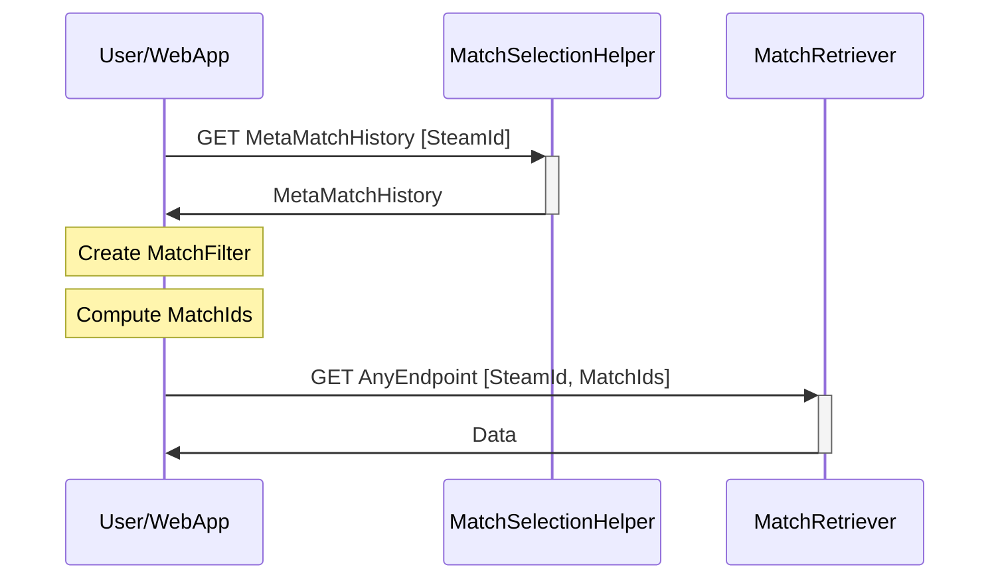
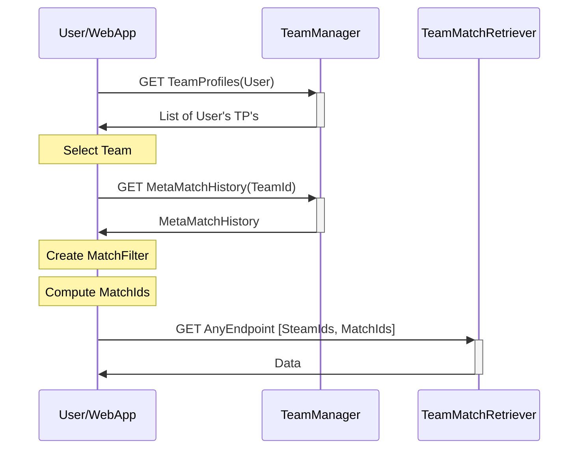

# Match selection
Analyses displayed in the webapp usually depend on data of one or multiple matches. For example, some analyses may require data "from the user's last match", or data "from the user's last 10 matchmaking matches on de_mirage". Here explained is the process of how those matches, more precisely their related matchids, are identified. 

## Information Flow

### Terminology
- `MMH`: MetaMatchHistory, a list where each entry contains metadata about a match played by the user/team. Each matches metadata contains properties like 
`{MatchId, Source, MatchDate, Map, IsIgnored, IsFavorite }`
- `MF`: MatchFilter, settings for how to filter matches in the MetaMatchHistory, e.g. by Map and/or Source.
- `TP` : TeamProfile containing metadata about a team like `{TeamId, Name, SteamIds[], ...}.

### Single Player

### Teams

 

## Advantages of giving the webapp the responsibility of computing the matchIds instead of a backend service
- Cheaper and more scaleable, since operations are carried out on users' hardware.
- Easier to maintain, as filter and selection behavior can be extended and adapted easily by only making changes to the webapp.
- The user's selection and the matchIds are always in sync (no room for bugs where data of other matches than the user expected is returned).

## Disadvantages
- More traffic (60kb to 60mb per visit, depending on how well you do math)
