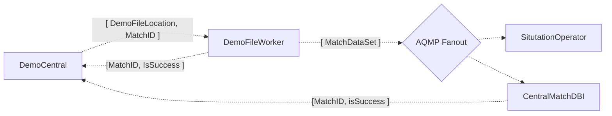

# Matches

Collection of information regarding the processing and storage of Matches.

### Terminology

- *Demo*: A .dem file produced by CS:GO containing logged replay data of a match.
- *Match* : A single Counter Strike: Global Offensive match consisting of multiple rounds.
- *MatchDataSet* : A representation of a *Match*.
- *MatchDb* : A datastore containing *MatchDataSets*.
- *DurableMatchDb* : The central singleton implementation of *MatchDb*.

# Demo => MatchDataSet

The communication process of extracting Match Data from a Demo.

## MatchWriter
MatchWriter consumes messages from DemoFileWorker's queue, loads the referenced MatchDataSets from a Redis cache, and inserts them into a MatchDb. 
MatchWriter can be configured to publish messages to a rabbit queue upon completion or failure of the insertion task.
It also provides means for other write operations regarding the MatchDb, e.g. removing matches.

### Environment Variables
- `MYSQL_CONNECTION_STRING` : 
Connection String to a Database.
    - If provided, MatchWriter will connect to the specified database.
    - If not provided, MatchWriter will create an InMemory database.
- `AMQP_URI` : URI to the rabbit cluster [*]
- `AMQP_DEMOFILEWORKER_QUEUE` : Rabbit queue's name for incoming matches
- `AMQP_CALLBACK_QUEUE`
Rabbit queue's name for sending a status report message after completion of insertion task. [*]

[*] *Required*

## MatchRetriever
MatchRetriever provides a REST interface with readonly endpoints designed for the webapp to access DurableMatchDb.

### Environment Variables
- `MYSQL_CONNECTION_STRING` : 
Connection String to a Database.
    - If provided, MatchWriter will connect to the specified database.
    - If not provided, MatchWriter will create an InMemory database.

## MatchSituationRetriever
MatchSituationRetriever provides a REST interface with readonly endpoints designed for SituationOperator to access TemporaryMatchDb.

### Environment Variables
- `MYSQL_CONNECTION_STRING` : 
Connection String to a Database.
    - If provided, MatchWriter will connect to the specified database.
    - If not provided, MatchWriter will create an InMemory database.

-------------------------------------------------

### Information Flow - DurableMatchDb
1. The DurableMatchDb's MatchWriter consumes message from DemoFileWorker and attempts to write the MatchDataSet into the database.
2. MatchWriter publishes a message to the `AMQP_CALLBACK_QUEUE` stating whether **step 1**. was successful or not.
3. DemoCentral consumes the message and updates its database accordingly. If **step 2** succeeded, the match is now available for the webapp.
4. After some time (on a scale of weeks), DemoCentral instructs the DurableMatchDb's MatchWriter to drop the match from its database.

### Information Flow - TemporaryMatchDb
1. The TemporaryMatchDb's MatchWriter consumes message from DemoFileWorker and attempts to write the MatchDataSet into the database.
2. MatchWriter publishes a message to the `AMQP_CALLBACK_QUEUE` stating whether **step 1**. was successful or not.
3. SituationOperator and other services that need to compute values once per match, consume the message and, if **step 2** succeeded, 
start doing their work that requires the match being in the TemporaryMatchDb (e.g. utilizing MatchSituationRetriever), and notify DemoCentral once they're done.
4. DemoCentral updates its database according to the messages from **step 3**.
5. Once all services from **step 3** have completed their task (either successfully or failed), DemoCentral instructs the TemporaryMatchDb's MatchWriter to drop the match.

## Publishing process
- Updating MatchEntities
    - MatchEntities is referenced by multiple projects, as it holds the definition for the MatchDataSets being transferred to MatchDBI and more, and also is the
Code First basis for the MatchDB schema.
    - MatchWriters should only accept MatchDataSets of one major version.
    - Publishing major updates (breaking changes) to MatchEntities should follow this pattern:
        1. Update DemoFileWorker so that it publishes MatchDataSets of newer version.
        2. Wait until all MatchDataSets of the previous version are consumed.
        3. Update MatchWriters and migrate the database schema at the same time, so that they accept MatchDataSets of the newer version.
        
        If, for some reason, MatchDataSets of the older version appear at consumers after **step 3**, the entire analysis of the match should be restarted beginning with 
(the new) DemoFileWorker.

