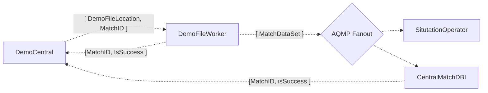
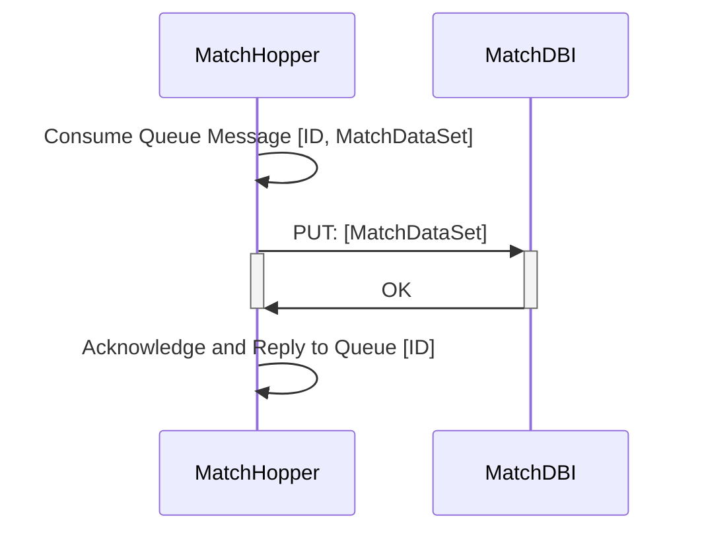
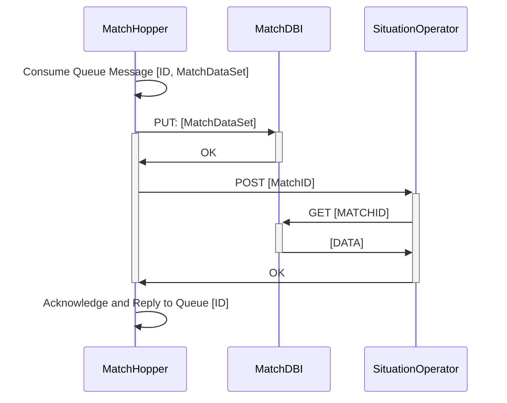

# Matches

Collection of information regarding the processing and storage of Matches.

### Terminology

- *Demo*: A file produced by CS:GO containing raw reply data of a match.
- *Match* : A single Counter Strike: Global Offensive match consisting of multiple rounds.
- *MatchDataSet* : A representation of a *Match*.
- *MatchDB* : A datastore containing *MatchDataSets*.
- *CentralMatchDB* : The central singleton implementation of *MatchDB*.

# Demo => MatchDataSet

The communication process of extracting Match Data from a Demo.

## MatchDBI
MatchDBI provides a REST interface for storage and retrieval of match data.

### External Configuration
- Connection String to a Database:
    - If provided, MatchDBI will connect to the specified database to store and retrieve data.
    - If not provided, MatchDBI will create an InMemory database.

## MatchHopper
Match hopper is responsible for consuming messages containing, or referencing MatchDataSets from a Rabbit Queue.

### External Configuration
- Queue Name to consume[*] - eg. `DFW_MDBI`
- Endpoint for message consumption[*] - Where to `PUT` the message contents. eg. `localost/match/`
- Endpoint to send a notifcation - Where to `POST` after a successful `PUT`.

[*] Required

### Information Flow - MatchDBI + MatchHopper

Where MatchDBI and MatchHopper are deployed as one container where a MatchDataSet needs to be consumed from a Rabbit Queue and written to a MatchDB via a MatchDBI instance.

### Functional Steps
1. MatchHopper consumes MatchDataSet from queue.
2. MatchHopper sends PUT request to MatchDBI.
3. MatchDBI attempts to upload to its MatchDB.
4. MatchDBI responds to request from step 3. with status (success or failure).
5. MatchHopper acknowledges the consumption and publishes status to the reply queue.
 
### Information Flow - MatchHopper + MatchDBI + SituationOperator

Where MatchDBI and MatchHopper are deployed as one container in a Pod with a SituationOperator container present and configured with the notification endpoint.

### Functional Steps
1. MatchHopper consumes MatchDataSet from queue.
2. MatchHopper sends PUT request to MatchDBI.
3. MatchDBI attempts to upload to its MatchDB.
4. MatchDBI responds to request from step 3. with status (success or failure).
5. MatchHopper sends POST containing MatchID to SituationOperator.
6. SituationOperator makes relevant calls to MatchDBI.
7. SituationOperator responds to request from step 5. with status (success or failure)
5. MatchHopper acknowledges the consumption and publishes status to the reply queue.

## Publishing process
- Updating MatchEntities
    - MatchEntities is referenced by multiple projects, as it holds the definition for the MatchDataSets being transferred to MatchDBI and more, and also is the Code First basis for the MatchDB schema.
    - Consumers of MatchDataSets (MatchDBI, SituationOperator) should only accept MatchDataSets of one major version.
    

    - Publishing major updates (breaking changes) to MatchEntities should follow this pattern:
        1. Update DemoFileWorker so that it publishes MatchDataSets of newer version.
        2. Wait until all MatchDataSets of the previous version are consumed.
        3. Update consumers (including MatchDBI and therefore the MatchDB using migrations) so that they only accept MatchDataSets of the newer version.
        
        If, for some reason, MatchDataSets of the older version appear at consumers after Step 3, the entire analysis of the match should be restarted beginning with (the new) DemoFileWorker.

