# MentorEngine

MentorEngine is a set of services running on a [Kubernetes][K8] cluster that make up the MENTOR.GG backend.

## Service Outline

- **MentorInterface**
    REST API exposed to the internet via an Ingress, providing authentication services and access to the Mentor Engine, and aggregates data from different sources.
- CS:GO:
    - **DemoCentral**
        Orchestrate demo acquisition and analysis.
    - **DemoDownloader**
        Download demos either from URL or file stream.
    - **DemoFile Worker**
        Obtain raw match data from a demo file and enriches the result.
    - **MatchDBI**
        Store and retrieve match data.
    - **SituationOperator**
        Store, retrieve and compute situation data.

## Information Flow

```mermaid
graph TD;
    I["🌎"] --- MI
    MI --- UDB((UserDB));
    
    MI --- SUDBI(SteamUserDBI);
    SUDBI --- SUDB((SteamUserDB));
    SUDBI --- SUDG[SteamUserDataGatherer];
    
    MI --- SCO[SharingCodeGatherer];
    SCO --- SWC[SteamworksConnection];
    SCO --- DC;
    
    MI --- FG[FaceitGatherer];
    FG --- DC;
    
    
    MI --- CDBI[ConfigurationDBI];
    CDBI --- CDB((ConfigurationDB));
    
    MI[MentorInterface] --- DC[DemoCentral];
    DC -.- DD[DemoDownloader];
    DC -.- DFW[DemoFileWorker];
    DFW -.- RMQ["🐰 Fanout"];
    RMQ -.- MDBI;
    RMQ -.- SO;
    
    DFW --- CDBI;

    MI --- MDBI[MatchDBI];
    MI --- SO[SituationOperator];
    SO --- SDB((SituationDB));
    MDBI --- MDB((MatchDB));

    classDef db fill:white;
    classDef queue fill:pink;
    class RMQ queue;
    class UDB,SUDB,CDB,SDB,MDB db;
```

## Further Reading:

- [RabbitMQ on GCP](https://github.com/GoogleCloudPlatform/click-to-deploy/blob/master/k8s/rabbitmq/README.md)
- [Design Patterns for Microservices](https://dzone.com/articles/design-patterns-for-microservices)

[K8]: https://kubernetes.io/
