# Mentor Engine

The Mentor Engine is a set of services running on a [Kubernetes][K8] cluster that make up the MENTOR.GG backend.

## Service Outline

- **Mentor Interface**
    REST API exposed to the internet via an Ingress, providing authentication services and access to the Mentor Engine, and aggregates data from different sources.
- CS:GO:
    - **Demo Central**
        Orchestrate demo acquisition and analysis.
    - **Demo Downloader**
        Download demos either from URL or file stream.
    - **Demo File Worker**
        Obtain raw match data from a demo file and enriches the result.
    - **Match DBI**
        Store and retrieve match data.
    - **Situation Operator**
        Store, retrieve and compute situation data.

## Information Flow

```mermaid
graph TD;
    I["🌎"] --- MI
    MI[Mentor Interface] --- DC[Demo Central];
    DC -.- DD[Demo Downloader];
    DC -.- DFW[Demo File Worker];
    DFW -.- RMQ["🐰 Fanout"];
    RMQ -.- MDBI;
    RMQ -.- SO;
    

    MI --- MDBI[Match DBI];
    MI --- SO[Situtation Operator];
    SO --- SDB((Situtation DB))
    MDBI --- MDB((Match DB))

    classDef db fill:white;
    classDef queue fill:pink;
    class RMQ queue;
    class SDB,MDB db;
```

## Further Reading:

- [RabbitMQ on GCP](https://github.com/GoogleCloudPlatform/click-to-deploy/blob/master/k8s/rabbitmq/README.md)
- [Design Patterns for Microservices](https://dzone.com/articles/design-patterns-for-microservices)

[K8]: https://kubernetes.io/
