# Mentor Engine

The Mentor Engine is a set of services running on a [Kubernetes][K8] cluster that perform analytics on game replays.

## Service Outline

- **Mentor Interface**
    REST API exposed to the internet via an Ingress, providing authentication services and access to the Mentor Engine.
- CS:GO:
    - **Demo Central**
        Orchastrate demo acquisition and analysis.
    - **Demo Downloader**
        Download demos either from URL of file stream.
    - **Demo File Worker**
        Obtain match data from a demo file and enriches the result.
    - **Match DBI**
        Store, retreive and compute match data.
    - **Situtation Operator**
        Store, retreive and compute misplay data.
    - **Combiner**
        Combine data sources.

## Information Flow

```mermaid
graph TD;
    I["🌎"] --- MI
    MI[Mentor Interface] --- DC[Demo Central];
    DC --- DD[Demo Downloader];
    DC --- DFW[Demo File Worker];
    DFW --- RMQ["🐰 AMQP"];
    RMQ --- MDBI;
    RMQ --- SO;
    

    MI --- MDBI[Match DBI];
    MI --- C[Combiner];
    MI --- SO[Situtation Operator];
    C --- MDBI;
    C --- SO;
    SO --- SDB((Situtation DB))
    MDBI --- MDB((Match DB))

    classDef db fill:white;
    classDef queue fill:pink;
    class RMQ queue;
    class SDB,MDB db;
```

[K8]: https://kubernetes.io/
