# MentorEngine

MentorEngine is a set of services running on a [Kubernetes][K8] cluster that make up the MENTOR.GG backend.

## Service Outline

- **MentorInterface**
    REST API exposed to the internet via an Ingress, providing authentication services and access to the Mentor Engine, and aggregates data from different sources.
- CS:GO:
    - **DemoCentral**
        Orchestrate demo acquisition and analysis.
    - **DemoDownloader**
        Download demos either from URL or file stream.
    - **DemoFile Worker**
        Obtain raw match data from a demo file and enriches the result.
    - **MatchDBI**
        Store and retrieve match data.
    - **SituationOperator**
        Store, retrieve and compute situation data.

## Information Flow

```mermaid
graph TD;
    I["🌎"] --- MI
    MI --- UDB((UserDB));
    
    MI --- SUDBI(SteamUserDBI);
    SUDBI --- SUDB((SteamUserDB));
    SUDBI --- SUDG[SteamUserDataGatherer];
    
    MI --- SCO[SharingCodeGatherer];
    SCO --- SWC[SteamworksConnection];
    SCO --- DC;
    
    MI --- FG[FaceitGatherer];
    FG --- DC;
    
    
    MI --- CDBI[ConfigurationDBI];
    CDBI --- CDB((ConfigurationDB));
    
    MI[MentorInterface] --- DC[DemoCentral];
    DC -.- DD[DemoDownloader];
    DC -.- DFW[DemoFileWorker];
    DFW -.- RMQ["🐰 Fanout"];
    RMQ -.- MDBI;
    RMQ -.- SO;
    
    DFW --- CDBI;

    MI --- MDBI[MatchDBI];
    MI --- SO[SituationOperator];
    SO --- SDB((SituationDB));
    MDBI --- MDB((MatchDB));

    classDef db fill:white;
    classDef queue fill:pink;
    class RMQ queue;
    class UDB,SUDB,CDB,SDB,MDB db;
```

## Publishing
- Updating MatchEntities
    - MatchEntities is referenced by multiple projects, as it holds the definition for the MatchDataSets being transferred to MatchDBI and more, and also is the Code First basis for the MatchDB schema.
    - Consumers of MatchDataSets (MatchDBI, SituationOperator) should only accept MatchDataSets of one major version.
    

    - Publishing major updates (breaking changes) to MatchEntities should follow this pattern:
        1. Update DemoFileWorker so that it publishes MatchDataSets of newer version.
        2. Wait until all MatchDataSets of the previous version are consumed.
        3. Update consumers (including MatchDBI and therefore the MatchDB using migrations) so that they only accept MatchDataSets of the newer version.
        
        If, for some reason, MatchDataSets of the older version appear at consumers after Step 3, the entire analysis of the match should be restarted beginning with (the new) DemoFileWorker.

## Further Reading:

- [RabbitMQ on GCP](https://github.com/GoogleCloudPlatform/click-to-deploy/blob/master/k8s/rabbitmq/README.md)
- [Design Patterns for Microservices](https://dzone.com/articles/design-patterns-for-microservices)

[K8]: https://kubernetes.io/
